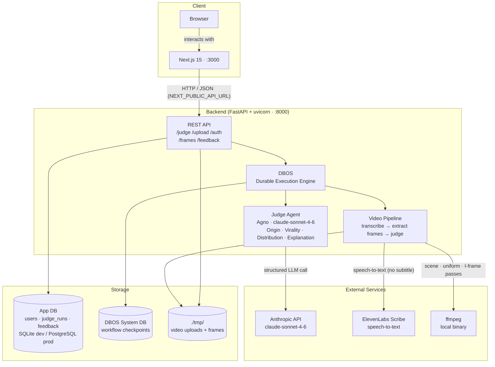

# Judge Agent — Architecture

## High-Level Architecture



---

## Problem Statement

Given a piece of content (text or video), produce four structured outputs:

1. **Origin** — AI-generated vs. human-generated, with confidence score and top signals
2. **Virality** — likelihood of strong social performance, scored 0–100
3. **Distribution** — 2–4 audience segments likely to engage, with platform and reaction type
4. **Explanation** — traceable reasoning across all four dimensions

---

## System Overview

Two processes, one data flow:

```
Browser (Next.js 15, :3000)
    │
    │  HTTP/JSON  (NEXT_PUBLIC_API_URL, default http://localhost:8000)
    ▼
Backend (FastAPI + uvicorn, :8000)
    │
    ├── SQLite  (judge_agent.db — app data)
    ├── SQLite  (dbos_system.db — DBOS workflow state)
    └── tmp/    (uploaded video files and extracted frames)
         │
         └── Anthropic API  (claude-sonnet-4-6)
```

The frontend is a Next.js 15 App Router single-page application. It calls the backend over HTTP. The backend owns all persistence, AI calls, and media processing. There is no server-side rendering that touches backend data — the frontend is purely a client-side UI.

---

## Backend

**Entry point:** `backend/app/main.py`
**Run:** `uvicorn app.main:app --reload`
**Port:** 8000 (configurable via `PORT` env var)

### Application startup

`main.py` defines a FastAPI `lifespan` handler that runs once per worker:

1. Initializes DBOS with its own system database (`dbos_system.db`)
2. In development + SQLite mode, auto-creates all application tables on first start using a `.sqlite_tables_created` sentinel file to avoid repeating DDL across workers

In production, schema changes go through Alembic migrations instead.

### API routes

All routes are registered in `main.py` via `app.include_router(...)`.

| Prefix | File | Purpose |
|---|---|---|
| `/judge` | `app/api/judge.py` | Core judge pipeline for text and video |
| `/auth` | `app/api/auth.py` | Username-based identity (no passwords) |
| `/upload` | `app/api/upload.py` | Multipart video + subtitle file upload |
| `/frames` | `app/api/frames.py` | Serve extracted frame images |
| `/feedback` | `app/api/feedback.py` | Thumbs up/down on judge results |
| `/` | `main.py` | Root metadata |
| `/health` | `main.py` | Health check |
| `/docs` | auto | Swagger UI (FastAPI built-in) |

#### Judge endpoints (`/judge`)

- `POST /judge` — Text analysis. Accepts `{content, user_uuid?}`. If `user_uuid` is provided, caches by `md5(content + user_uuid)` and stores the run in `judge_runs`. Returns `JudgeOutput`.
- `GET /judge/history?user_uuid=<uuid>` — Returns up to 50 prior runs for a user, newest first.
- `POST /judge/video` — Video analysis. Accepts `{upload_id, user_uuid?}`. Runs the three-step DBOS video workflow (transcribe → extract frames → judge).

#### Upload endpoint (`/upload`)

- `POST /upload` — Multipart form: `video_file` (required) + `subtitle_file` (optional). Validates MIME type and extension. Saves to `./tmp/<upload_id>/`. Returns `{upload_id, has_subtitles}`.
- Supported video formats: `.mp4`, `.mov`, `.webm` (500 MiB limit)
- Supported subtitle formats: `.srt`, `.vtt`, `.txt` (10 MiB limit)

#### Frames endpoints (`/frames`)

- `GET /frames/<upload_id>` — Lists extracted frames with type labels (`scene`, `uniform`, `keyframe`)
- `GET /frames/<upload_id>/file/<filename>` — Serves a single JPEG frame

### Judge agent

**File:** `backend/app/agents/judge_agent.py`

Single Agno `Agent` instance per request. One LLM call produces all four output dimensions simultaneously. This is intentional: correlated outputs with a single reasoning trace are more internally consistent than four independent agent calls.

**Model:** `claude-sonnet-4-6` (Anthropic) via the `agno` abstraction layer. Swapping models requires changing `DEFAULT_MODEL_ID` only.

**Prompt assembly** is phase-aware:

| Content type | Prompts loaded |
|---|---|
| `TEXT` | `prompts/judge_text.txt` |
| `TRANSCRIPT` | `judge_text.txt` + `judge_transcript.txt` |
| `VIDEO` | `judge_text.txt` + `judge_transcript.txt` + `judge_video.txt` |

Prompts live at `backend/app/agents/prompts/`.

**DBOS wrapping:** The Claude call is wrapped in a `@DBOS.step` with 3 retries, exponential backoff (rate: 2.0, 1s base). The outer `judge_workflow` is a `@DBOS.workflow`, giving the pipeline checkpoint-and-resume on failure.

### Video pipeline

**File:** `backend/app/agents/video_pipeline.py`

Three sequential DBOS steps, each retried independently:

1. **`transcribe_or_parse`** — Checks for a subtitle file in the upload directory. If found, strips SRT/VTT timing metadata and returns plain text. If not found, calls ElevenLabs Scribe (`scribe_v1` model) for speech-to-text. Falls back to a mock transcript if `ELEVENLABS_API_KEY` is unset.

2. **`extract_frames`** — Runs three ffmpeg passes against the uploaded video:
   - Scene-change frames (`select='gt(scene,0.35)'`) → `sc_XXXXXX.jpg`
   - Uniform 2fps sample → `uni_XXXXXX.jpg`
   - I-frames only (`eq(pict_type,I)`) → `i_XXXXXX.jpg`
   - All frames saved to `./tmp/<upload_id>/frames/`

3. **Judge step** — Combines transcript text + frame count summary, calls `run_judge` with `ContentType.VIDEO`.

The entire three-step sequence is wrapped in `judge_video_workflow`, a `@DBOS.workflow`. If any step fails after exhausting retries, DBOS can resume from the last completed checkpoint without re-running earlier steps.

### Output schema

**File:** `backend/app/agents/output.py`

```python
JudgeOutput
├── origin: OriginOutput
│   ├── prediction: "AI-generated" | "human-generated"
│   ├── confidence: float  # 0.0–1.0
│   └── signals: list[str]  # 1–3 items
├── virality: ViralityOutput
│   ├── score: int  # 0–100
│   └── drivers: list[str]  # 1–5 items
├── distribution: list[DistributionSegment]  # 2–4 items
│   ├── segment: str
│   ├── platforms: list[str]
│   └── reaction: "share" | "save" | "comment" | "ignore"
├── explanation: str
└── run_id: str | None  # populated after DB persist
```

`output_schema=JudgeOutput` is passed directly to the Agno `Agent`. Agno enforces structured output — the response is validated as `JudgeOutput` before the step returns; a `TypeError` on mismatch triggers DBOS retry.

### Database layer

**Files:** `backend/app/db/dbos.py`, `backend/app/db/models.py`

- ORM: SQLAlchemy 2.x (mapped columns, `DeclarativeBase`)
- Default database: SQLite (`judge_agent.db`) — no extra driver, works out of the box
- Production: PostgreSQL via `DATABASE_URL=postgresql://...` + `pip install '.[postgres]'`
- Sessions: per-request via `get_db()` FastAPI dependency; `DatabaseManager` singleton holds the engine and session factory

**Tables:**

| Table | Purpose |
|---|---|
| `users` | Username + auto-assigned UUID. No passwords. |
| `judge_runs` | Cached judge results. PK is `md5(content\0user_uuid)`. FK to `users`. |
| `feedback` | Thumbs up/down per `judge_request_id`. Not FK'd to `judge_runs` so it works for both text and video. |

DBOS maintains a separate `dbos_system.db` for its own workflow state. This database is not application data — do not inspect it directly.

### Configuration

**File:** `backend/app/core/config.py`

`Settings` is a Pydantic `BaseSettings` class. All values are overridable via environment variables or `.env` file.

Key settings:

| Variable | Default | Notes |
|---|---|---|
| `ENVIRONMENT` | `development` | `development` \| `testing` \| `production` |
| `PORT` | `8000` | uvicorn listen port |
| `DATABASE_URL` | `sqlite:///./judge_agent.db` | Set to `postgresql://...` for production |
| `DBOS_SYSTEM_DATABASE_URL` | `sqlite:///dbos_system.db` | DBOS internal state |
| `ANTHROPIC_API_KEY` | `""` | Required for judge to function |
| `ELEVENLABS_API_KEY` | `""` | Required for video transcription without subtitle files |
| `CORS_ORIGINS` | `["http://localhost:3000", "http://localhost:3001", "http://localhost:8000"]` | Expand for production |
| `TMP_DIR` | `./tmp` | Video uploads and frame storage |
| `SECRET_KEY` | dev default | Must be changed in production (enforced) |

`_TolerantEnvSource` overrides Pydantic's default env parsing to handle dotenv-mangled JSON arrays (a known issue with `uv` and `dotenvy`).

---

## Frontend

**Entry point:** `frontend/app/page.tsx`
**Run:** `npm run dev` (Next.js 15 dev server)
**Port:** 3000 (Next.js default)
**Framework:** Next.js 15 App Router, React 19, TypeScript strict

The entire application is a single page (`page.tsx`) with `'use client'` — no server components, no server actions. State is managed with `useState`/`useEffect`. User identity is persisted to `localStorage`.

### Frontend structure

```
frontend/app/
├── page.tsx              — full application (login, mode selector, text analysis, video upload)
├── layout.tsx            — root layout: Inter font, metadata
├── error.tsx             — error boundary
├── not-found.tsx         — 404 page
├── globals.css           — Tailwind base styles
├── components/
│   ├── Button.tsx        — reusable button
│   ├── Card.tsx          — reusable card
│   ├── Header.tsx        — top nav (referenced in layout)
│   └── Footer.tsx        — footer
└── lib/
    ├── api.ts            — typed fetch wrapper + all API call functions
    ├── constants.ts      — API_BASE_URL, API_ENDPOINTS, timeouts
    ├── types.ts          — TypeScript interfaces mirroring backend Pydantic models
    ├── hooks.ts          — custom React hooks
    └── utils.ts          — cn() and other utilities
```

### API communication

`frontend/app/lib/api.ts` exports typed functions for every backend endpoint:

- `signup(username)` → `POST /auth/signup`
- `judgeContent(content, userUuid?)` → `POST /judge`
- `getHistory(userUuid)` → `GET /judge/history`
- `judgeVideo(uploadId, userUuid?)` → `POST /judge/video`
- `uploadFile(videoFile, subtitleFile?)` → `POST /upload` (multipart)
- `getFrames(uploadId)` → `GET /frames/<uploadId>`
- `submitFeedback(request)` → `POST /feedback`

The `ApiClient` class wraps `fetch` with: configurable timeout (default 30s), exponential-backoff retry on network failure (default 3 retries), and typed `ApiError` on non-2xx responses.

**Base URL:** `NEXT_PUBLIC_API_URL` env var, defaults to `http://localhost:8000`.

### Styling

Tailwind CSS v4. No shadcn/ui — components are hand-built. Icon set: `lucide-react`. Font: Inter (Google Fonts via `next/font`).

---

## Data Flow: Text Analysis

```
1. User pastes text → clicks Analyze
2. POST /judge  {content, user_uuid}
3. Backend checks cache: SELECT FROM judge_runs WHERE id = md5(content+user_uuid)
4. Cache miss → judge_workflow(content, TEXT)
   a. _call_claude (DBOS step, 3 retries)
      - create_judge_agent(ContentType.TEXT)
      - Agent loads judge_text.txt system prompt
      - agent.arun(content) → Claude claude-sonnet-4-6
      - Response validated as JudgeOutput
5. INSERT INTO judge_runs
6. Return JudgeOutput (with run_id)
7. Frontend renders origin, virality, distribution, explanation
8. User clicks thumbs up/down → POST /feedback
```

## Data Flow: Video Analysis

```
1. User drops video (+ optional subtitle) → clicks Upload
2. POST /upload  multipart: video_file [+ subtitle_file]
   - Saved to ./tmp/<upload_id>/video.mp4 [+ subtitles.srt]
   - Returns {upload_id, has_subtitles}
3. POST /judge/video  {upload_id}
4. judge_video_workflow (DBOS workflow — checkpointed)
   Step A: transcribe_or_parse(upload_id)
     - Subtitle present → strip timing → plain text
     - No subtitle → ElevenLabs Scribe → plain text
   Step B: extract_frames(upload_id)
     - ffmpeg: scene changes → sc_*.jpg
     - ffmpeg: 2fps uniform → uni_*.jpg
     - ffmpeg: I-frames → i_*.jpg
     - Saved to ./tmp/<upload_id>/frames/
   Step C: run_judge(transcript + "[N frames]", ContentType.VIDEO)
     - Agent loads judge_text + judge_transcript + judge_video prompts
     - Claude call (DBOS step, 3 retries)
5. Return JudgeOutput
6. Frontend fetches GET /frames/<upload_id> → renders frame grid
7. Frontend renders judge result card
```

---

## Key Technology Choices

| Concern | Technology | Why |
|---|---|---|
| Language | Python 3.11+ | LLM and media tooling ecosystem |
| API framework | FastAPI | Async, typed, OpenAPI auto-docs |
| Durable execution | DBOS 2.x | Checkpoint-and-resume on LLM/media failures; no re-running completed steps |
| Agent framework | Agno 1.x | LLM abstraction; swap models without prompt changes |
| LLM | Anthropic claude-sonnet-4-6 | Structured output, vision support, 100% eval accuracy on detection task |
| Video transcription | ElevenLabs Scribe (`scribe_v1`) | Speech-to-text when no subtitle file provided |
| Frame extraction | ffmpeg-python | Scene changes + uniform sampling + I-frames |
| Database (dev) | SQLite | Zero-config, built into Python |
| Database (prod) | PostgreSQL | `pip install '.[postgres]'` + set `DATABASE_URL` |
| ORM | SQLAlchemy 2.x | Type-safe mapped columns |
| Frontend | Next.js 15, React 19, TypeScript | App Router SPA |
| Styling | Tailwind CSS v4 | Utility-first, no component library dependency |
| Tests | pytest-asyncio + eval script | Async test support; `eval_detection.py` runs judge against labeled fixtures |

---

## Deployment Topology

**Development (default):**

```
localhost:3000   Next.js dev server  (npm run dev)
localhost:8000   FastAPI + uvicorn   (uvicorn app.main:app --reload)
./judge_agent.db  SQLite app database
./dbos_system.db  SQLite DBOS state
./tmp/            Video uploads + frames
```

**Production (not yet configured):**

The code supports production mode with these changes:
- Set `DATABASE_URL=postgresql://...` and `DBOS_SYSTEM_DATABASE_URL=postgresql://...`
- Set `ENVIRONMENT=production` and a real `SECRET_KEY`
- Run Alembic migrations instead of `create_all_tables()`
- Replace `./tmp/` with S3 or equivalent object storage (noted in frontend UI)
- Set `CORS_ORIGINS` to actual frontend origin
- Set `NEXT_PUBLIC_API_URL` to the backend's production URL

No Docker Compose file exists yet. Each process is run directly.

---

## File Structure (actual)

```
judge-agent/
├── README.md
├── ARCHITECTURE.md               ← this file
├── GETTING_STARTED.md
├── backend/
│   ├── pyproject.toml            ← dependencies, tool config (ruff, mypy, pytest)
│   └── app/
│       ├── main.py               ← FastAPI app factory, lifespan, route registration
│       ├── agents/
│       │   ├── judge_agent.py    ← Agno agent, DBOS workflow, public run_judge()
│       │   ├── video_pipeline.py ← transcribe + frame extract + judge workflow
│       │   ├── output.py         ← Pydantic output models (JudgeOutput, etc.)
│       │   ├── base.py           ← AgentRegistry (unused by production paths)
│       │   └── prompts/
│       │       ├── judge_text.txt
│       │       ├── judge_transcript.txt
│       │       └── judge_video.txt
│       ├── api/
│       │   ├── judge.py          ← POST /judge, GET /judge/history, POST /judge/video
│       │   ├── auth.py           ← POST /auth/signup
│       │   ├── upload.py         ← POST /upload
│       │   ├── frames.py         ← GET /frames/<id>, GET /frames/<id>/file/<name>
│       │   └── feedback.py       ← POST /feedback
│       ├── core/
│       │   └── config.py         ← Pydantic Settings, all env vars
│       └── db/
│           ├── dbos.py           ← DatabaseManager, SQLAlchemy engine, get_db()
│           └── models.py         ← User, JudgeRun, Feedback ORM models
├── frontend/
│   ├── package.json
│   └── app/
│       ├── page.tsx              ← entire SPA: login, mode select, text/video analysis
│       ├── layout.tsx            ← root layout, Inter font
│       ├── globals.css
│       ├── components/
│       │   ├── Button.tsx
│       │   ├── Card.tsx
│       │   ├── Header.tsx
│       │   └── Footer.tsx
│       └── lib/
│           ├── api.ts            ← fetch wrapper, all API functions
│           ├── constants.ts      ← API_BASE_URL, endpoints, timeouts
│           ├── types.ts          ← TypeScript interfaces
│           ├── hooks.ts          ← custom hooks
│           └── utils.ts          ← cn() etc.
└── backend/tests/
    ├── eval_detection.py         ← accuracy eval: run against labeled fixtures
    └── fixtures/
        ├── ai_samples.json
        └── human_samples.json
```

---

## Design Decisions & Trade-offs

### Single LLM call for all four outputs

The judge agent makes one Claude call and returns all four dimensions (origin, virality, distribution, explanation) in a single structured response.

**Alternative considered:** Four independent agent calls, one per dimension.

**Why one call:** The four outputs are correlated. An AI-generated piece of content has different virality drivers than a human-written one; the explanation must reference all three other dimensions. Separate calls produce four internally consistent answers that are not consistent *with each other*. A single call forces the model to reason across all dimensions simultaneously, which is the right framing for this problem.

**Cost:** One call per analysis. Cannot parallelize or cache individual dimensions.

### MD5 content-hash caching

`POST /judge` caches by `md5(content + user_uuid)`. Identical content from the same user returns the stored result without an LLM call.

**Why per-user, not global:** Same content can have different relevance for different users (e.g., a user's own writing vs. copied text). Per-user cache avoids cross-user data leakage while still saving redundant calls.

**Collision risk:** MD5 has known theoretical collisions but is not being used as a security primitive here — it is a cache key. The probability of a collision between two distinct pieces of content is negligible in practice.

### DBOS for durable execution

The judge workflow and each video pipeline step are wrapped in DBOS `@DBOS.workflow` / `@DBOS.step`.

**What this buys:** If the server restarts mid-video pipeline (e.g., during frame extraction or the LLM call), DBOS resumes from the last completed checkpoint instead of starting over. For a pipeline that can take 30–120 seconds on long videos, this is meaningful.

**What this costs:** DBOS maintains its own system database (`dbos_system.db`). Every step completion is written there before returning. This adds one DB write per step on the critical path.

**Alternative considered:** Celery + Redis. DBOS was chosen because it requires no external broker, runs in-process, and the SQLite backend works out of the box in development.

### SQLite in development, PostgreSQL in production

SQLite requires no installation and auto-creates on first start. The `.[postgres]` optional dependency and `DATABASE_URL` env var make the switch to PostgreSQL a one-line config change.

**Caveat:** SQLite has no connection pooling and does not support concurrent writes. Under any meaningful load, the development default will serialize writes and eventually deadlock. Do not run SQLite in a multi-worker deployment.

### Three ffmpeg passes for frame extraction

Scene changes, uniform 2fps sampling, and I-frame extraction are three separate ffmpeg invocations against the same video file.

**Why three passes instead of one:** Each filter selects frames on different criteria. A single complex filtergraph combining all three would require careful frame deduplication and would be harder to reason about. Three passes are simple and independently debuggable.

**Cost:** Three reads of the video file instead of one. For large videos this is slower and uses more I/O. Acceptable for a PoC; a production system would merge these into a single filtergraph.

### No streaming

The API returns judge results as a single JSON response after the full pipeline completes. For video, this means the client blocks for however long transcription + frame extraction + LLM call takes.

**Impact:** Long videos (>5 minutes) can take 2–4 minutes end-to-end. The frontend currently has no progress indicator.

**Path to fix:** DBOS supports step-level notifications. Adding a WebSocket endpoint that emits step-completion events would let the frontend show progress without changing the pipeline logic.

---

## Concurrency & Scaling

### Request handling

FastAPI runs on uvicorn with a single worker by default. The LLM call (`agent.arun`) and ElevenLabs call are `async` — the event loop can serve other requests while waiting for those I/O operations. ffmpeg subprocess calls are blocking and will hold the worker thread for their duration.

**Implication:** A single long-running video request will not block *other* requests' LLM calls, but will occupy an OS thread during ffmpeg execution. Under high concurrent video load, run multiple uvicorn workers (`--workers N`) or move ffmpeg to a background task queue.

### LLM rate limits

Claude Tier 1 is 50 RPM / 30K input tokens per minute for Sonnet 4.x. The eval harness (`eval_detection.py`) implements a semaphore (default `MAX_CONCURRENT=5`) and exponential backoff on 429s to stay within tier limits. The production API has no rate-limiting middleware yet — all requests reach the LLM directly.

### State and horizontal scaling

All durable state lives in the database (app DB + DBOS system DB). Uploaded files live on local disk in `./tmp/`. This means:

- **Stateless workers:** Multiple uvicorn processes on the same machine can share SQLite safely for reads, but SQLite write serialization becomes a bottleneck. With PostgreSQL, multiple workers scale normally.
- **Not multi-host yet:** `./tmp/` is local disk. A second machine cannot serve frames from an upload that happened on the first. Moving to S3 (or any shared object store) is the prerequisite for multi-host horizontal scaling.

---

## Failure Modes

| Failure | Behavior |
|---|---|
| Anthropic API down / rate limit | DBOS retries up to 3× with exponential backoff. After exhausting retries, the workflow fails and returns a 500 to the client. |
| ElevenLabs API down | DBOS retries 3×. If `ELEVENLABS_API_KEY` is unset, falls back to a mock transcript instead of failing. |
| ffmpeg not installed | `extract_frames` raises `FileNotFoundError`. No retry — the environment is broken. |
| Video too large | `POST /upload` rejects files >500 MiB before any processing. |
| DBOS system DB corrupted | Workflows cannot checkpoint. The app starts but all workflow calls fail. Delete `dbos_system.db` to reset (loses in-flight workflow state). |
| SQLite write contention | Under concurrent writes, SQLite serializes and may return `OperationalError: database is locked`. Mitigated by switching to PostgreSQL. |

---

## Performance Characteristics (approximate)

| Operation | Typical latency |
|---|---|
| `POST /judge` (text, cache miss) | 3–8 seconds (LLM call) |
| `POST /judge` (text, cache hit) | <50ms (DB read) |
| `POST /upload` (100 MB video) | 1–3 seconds (disk write) |
| `POST /judge/video` (2-min video, no subtitles) | 30–90 seconds (transcription + ffmpeg + LLM) |
| `POST /judge/video` (2-min video, subtitles provided) | 10–20 seconds (ffmpeg + LLM, no transcription) |
| `GET /judge/history` | <100ms (indexed DB query) |

---

## What Is Not Here Yet

- **No unit tests** — only the eval harness (`eval_detection.py`). Unit tests for individual modules are unwritten.
- **No Docker Compose** — processes are run directly; containerization is not yet configured.
- **No production object storage** — `./tmp/` is local disk. The frontend notes "Production will use S3."
- **No auth security** — `POST /auth/signup` returns a UUID for any username with no verification. The login screen acknowledges this explicitly ("Auth is basically vibes"). Appropriate for a proof-of-concept.
- **No streaming** — judge results are returned as a single JSON response. Long videos block until the full pipeline completes.
